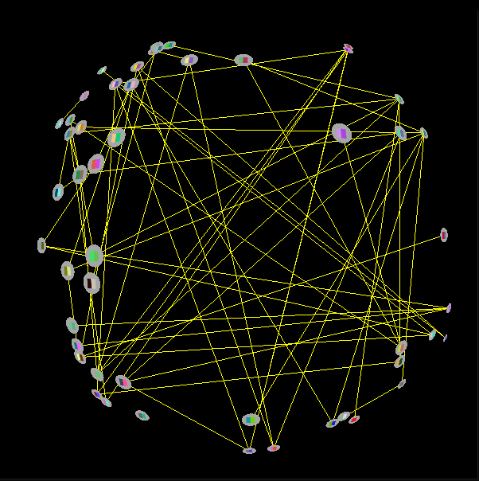
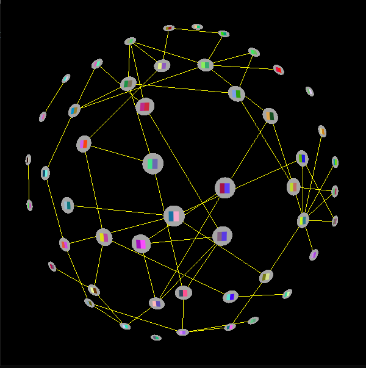
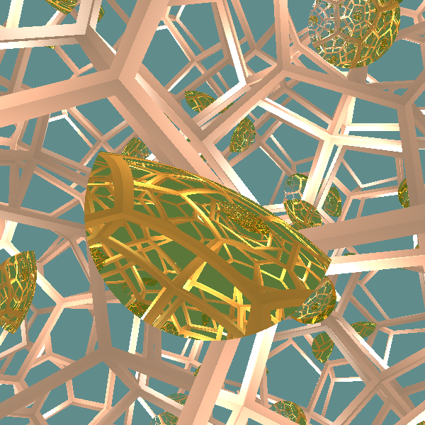
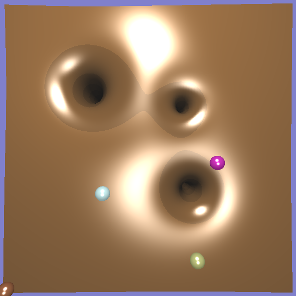

Kisebb C++-ban írt, a megadott keretrendszert használó OpenGL feladatok.

# Első feladat

Gráfmegjenelítő program, amely a hiperbolikus sík és annak vetítésének segítségével jeleníti meg a véletlenszerűen generált gráfot. A csomópontok textúrázottak. A gráf mozgatható a felületen, szóköz lenyomására egy erővezérelt szimulációval elrendezi a csomópontokat.

# Második feladat

Videókártyán futó egyszerű ray tracing. Dodekaéder alakú szobában lévő tükröződő arany objektum található. A dodekaéder falain egy ugyanolyan, de 72 fokkal elforgatott szobára lehet átnézni. A kamera folyamatosan forog az objektum körül.

# Harmadik feladat

Gumilepedőt szimuláló feladat. Súlyok helyezhetők el, amelyek meghajlítják a lepedőt. A lepedőre golyók indíthatók, amelyek a meghajlított lepedőn mennek és leesnek a lyukakba. Két fényforrás forog egymás körül. A legutoljára elindított golyó útja a golyó szemszögéből is követhető.

